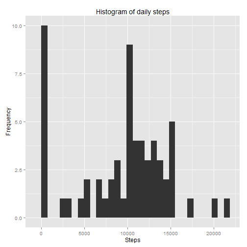
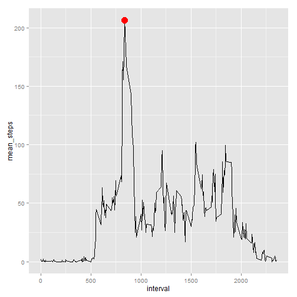
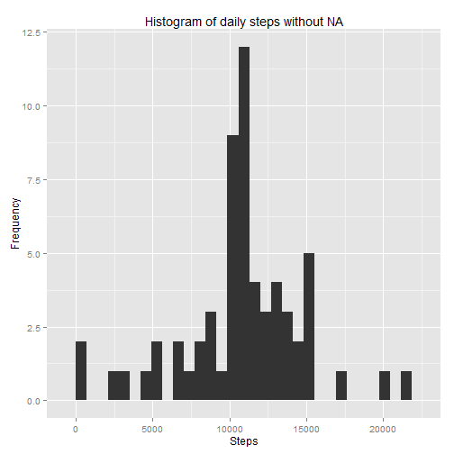
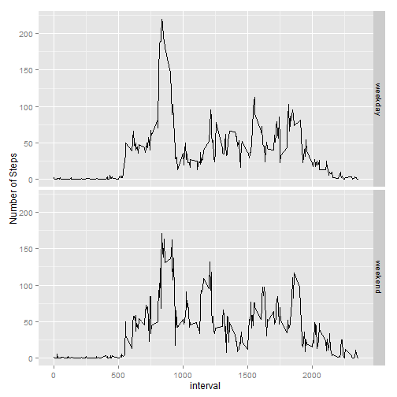

## Loading and preprocessing the data  

----


* Load the necessary libraries


```r
if (!require("timeDate")) install.packages("timeDate")
if (!require("ggplot2")) install.packages("ggplot2")
```

* Load the activity file (data)


```r
if(!file.exists('activity.csv'))
    unzip('activity.zip')
activity <- read.csv("activity.csv")
```

* Transform date from factor into date variable


```r
activity$date <- as.POSIXct(activity$date)
```

## What is mean total number of steps taken per day?

---

* We ignore NA value and plot the histogram


```r
daily_steps <- aggregate(activity$steps, by = list(activity$date), sum, na.rm=TRUE) 
names(daily_steps) <- c("Date", "steps")

ggplot(daily_steps,aes(x = steps)) +
    ggtitle("Histogram of daily steps") +
    xlab("Steps") +
    ylab("Frequency") +
	geom_histogram()
```

 

* We calculate the mean and median of the total number of steps taken per day

```r
mean(daily_steps$steps, na.rm="TRUE")
```

```
## [1] 9354.23
```

```r
median(daily_steps$steps, na.rm="TRUE")
```

```
## [1] 10395
```


## What is the average daily activity pattern?

* Calculate the time series plot of the 5-minute interval (x-axis) and the average number of steps taken, averaged across all days (y-axis)


```r
avg_steps <- aggregate(activity$steps, by = list(activity$interval), mean, na.rm=TRUE)
names(avg_steps) = c("interval", "mean_steps")
```

* Find the 5-minute interval, on average across all the days in the dataset, which contains the maximum number of steps

```r
max_avg_steps <- avg_steps[which.max(avg_steps$mean_steps),]
```

* Plot the time series

```r
ggplot(avg_steps, aes(x = interval, y = mean_steps)) + geom_line() + geom_point(x = max_avg_steps$interval, y=max_avg_steps$mean_steps, color='red',size=5)
```

 

* The interval with the maximum number of steps

```r
max_avg_steps$interval
```

```
## [1] 835
```


## Imputing missing values


*  Merge so that there is a new column that contains the average of the specific interval of each row


```r
imputed_steps <- merge( x = activity, y = avg_steps, by = "interval", all.x = TRUE)
```


* Find and filter out the NA values, along with tidying up the needed data


```r
selected <- which(is.na(imputed_steps$steps))
imputed_steps[selected,"steps"] <- imputed_steps[selected,"mean_steps"]
imputed_steps <- imputed_steps[,1:3]
daily_steps2 <- aggregate(imputed_steps$steps, by = list(imputed_steps$date), sum, na.rm=TRUE)
names(daily_steps2) <- c("Date", "steps")
```

* Plot the histogram of daily steps without NA


```r
ggplot(daily_steps2,aes(x = steps)) +
    ggtitle("Histogram of daily steps without NA") +
    xlab("Steps") +
	ylab("Frequency") +
    geom_histogram()
```

 


## Are there differences in activity patterns between weekdays and weekends?

* Create a new factor variable with two levels, weekday and weekend 

```r
imputed_steps$weekday <- ifelse(isWeekday(imputed_steps$date, wday=1:5),"weekday","weekend")
imputed_steps$weekday <- as.factor(imputed_steps$weekday)
```

* Calculate and create a panel plot containing a time series plot of the 5-minute interval (x-axis) and the average number of steps taken, averaged across all weekday days or weekend days (y-axis).


```r
mean_weekday <- aggregate(imputed_steps$steps, by = list(imputed_steps$weekday, imputed_steps$interval), mean, na.rm = TRUE)
names(mean_weekday) = c("weekday", "interval","mean_steps")
ggplot(mean_weekday, aes(x = interval, y = mean_steps)) + ylab("Number of Steps") + geom_line() + facet_grid(weekday~.)
```

 


